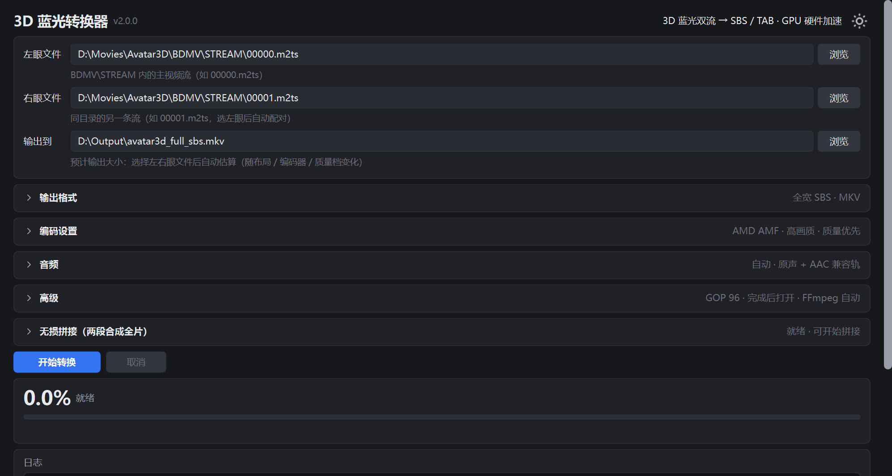
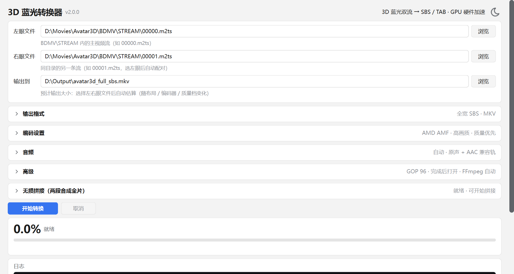
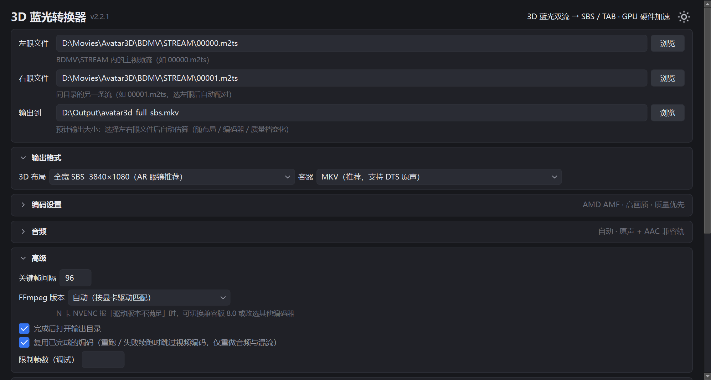
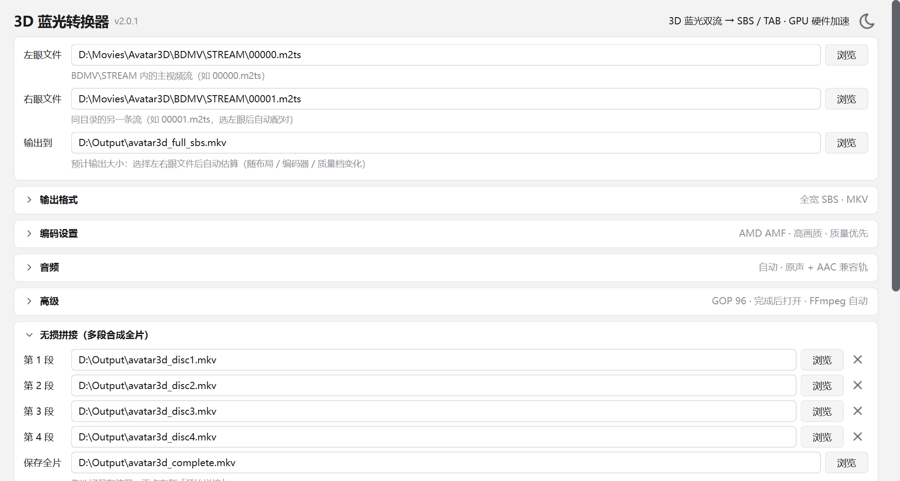

# 3D 蓝光转换器（3D Blu-ray Converter）

把 **3D 蓝光原盘** 转换成 **SBS / TAB 立体视频**（HEVC 硬件编码，支持 AMD / NVIDIA / Intel 显卡），
供 AR 眼镜 / VR 头显 / 3D 电视观看。



## 下载

**免安装便携版**（内置全部工具链，解压即用，约 260 MB）：

https://github.com/hugo-feng/3d-bluray-converter/releases/download/v2.3.0/3DBlurayConverter_v2.3.0_portable.zip

> 解压到**纯英文路径**，双击 `3DBlurayConverter.exe` 运行。需要 Windows 10/11 x64。

## 界面预览

| 浅色主题 | 展开设置项 |
|---|---|
|  |  |



## 功能

- **4 种 3D 布局**：全宽 SBS 3840×1080（AR 眼镜推荐）/ 半宽 SBS 1920×1080 /
  全高 TAB 1920×2160 / 半高 TAB 1920×1080
- **编码器**：AMD AMF（A 卡）/ NVIDIA NVENC（N 卡）/ Intel QSV（I 卡）/ CPU x265
  - 启动时自动检测显卡并选择匹配的编码器
  - **内置 2 个 FFmpeg 版本**：最新 master（需 NVIDIA 驱动 610+）与兼容版 8.0（需 570+），
    按显卡驱动版本**自动匹配**；也可在「高级 → FFmpeg 版本」手动指定
  - **编码器可用性预检**：开始前 3 帧测试编码，不可用立即提示（不会浪费解流时间）
- **质量模式**：恒定质量 CQP/CRF、目标平均码率、固定码率；4 档预设或自定义
- **编码速度**：质量优先 / 平衡 / 速度优先；可自定义关键帧间隔
- **音轨**：自动探测原盘全部音轨，可指定主音轨；输出模式支持
  原声 + AAC 兼容轨（推荐，手机也能放）/ 仅原声无损直通 / 仅 AAC / 无音轨
- **容器**：MKV（支持 DTS 原声）/ MP4（手机兼容性最好，自动处理音轨转码）
- **无损拼接**：多段（至高 16 段）按顺序导入 + 选择保存位置 → 一键合成完整片；
  支持添加 / 移除任意分段；mkvmerge 直封装不重编码，音轨 / 字幕 / 章节全部保留；
  先写临时文件成功后原子替换，中途失败不会破坏已有文件
- **大小预估**：选择左右眼后实时预估成品大小；拼接时实时显示全片预计大小
- **进度与倒计时**：解流 / 编码 / 音频 / 混流各阶段实时进度、帧率与剩余时间；
  长时间无输出时自动提示"仍在运行"（大文件写盘 / 解码器初始化较慢时不再像卡死）
- **失败续跑**：任务中间文件集中在专属文件夹（`_bd3d_work_*`）；
  失败 / 取消时保留，重跑自动复用已完成的编码（跳过视频编码，直接重做音频与混流）；
  转换成功后自动清理该文件夹
- 智能磁盘空间预检、完成后自动打开输出目录、参数自动记忆
- 深色 / 浅色主题一键切换、设置区折叠、平滑滚动、圆角控件、窗口比例自适应屏幕

## 源文件说明

3D 蓝光原盘在 `BDMV\STREAM` 目录下有两个视频流文件：

| 文件 | 内容 |
|---|---|
| `00000.m2ts` | 左眼画面（AVC 基础视图，音轨也在这个文件里） |
| `00001.m2ts` | 右眼画面（MVC 依赖视图） |

软件需要**分别选择这两个文件**——选择左眼文件后会自动配对同目录的右眼文件。

## 使用方法

1. 双击 `3DBlurayConverter.exe` 打开软件（右上角可切换深色 / 浅色主题）
2. 「左眼文件」→ 浏览选择 `BDMV\STREAM\00000.m2ts`（右眼会自动配对）
3. 「输出到」→ 选择保存路径（下方会**实时预估成品大小**；正式开始前会自动检查磁盘空间）
4. 按需展开「输出格式 / 编码设置 / 音频 / 高级」调整参数（收起时右侧显示当前配置摘要）
5. 点击「开始转换」——开始前先做**编码器可用性预检**（约 1 秒），
   进度区实时显示 解流中 / 编码中 / 音频提取 / 混流封装 与预计剩余时间
6. 若影片分多张碟（或分成多个文件）：在「无损拼接」区按顺序添加各段
   （至高 16 段，可随时添加 / 移除），选择保存位置后点「开始拼接」
   （按钮左侧显示预计全片大小）

**关于中文路径**：软件所在的目录必须全英文（否则内置解码器无法加载）。
如果输出路径含中文字符，软件会自动把中间文件放到同盘根目录（日志中有提示）；
建议输出路径也使用纯英文，最稳定。

**播放**：把成品拷到手机，用 **VLC** 全屏播放，眼镜切到「3D 左右」模式。
> 注意：部分手机自带播放器会缩放画面，导致眼镜端 3D 对齐异常，请用 VLC / MX Player
> （MX Player 需开启"使用外接显示器"）。

## 环境要求

- **系统**：Windows 10 / 11 x64
- **显卡**（任一即可，均为硬件加速）：
  - AMD 显卡（AMF 硬编 HEVC）
  - NVIDIA 显卡（NVENC 硬编 HEVC；驱动 570+ 使用兼容版 FFmpeg，驱动 610+ 可用最新版）
  - Intel 核显 / 独显（QSV 硬编 HEVC）
  - 无兼容显卡时可用 CPU x265（速度较慢）
- **磁盘空间**：转换需要「解流中间文件（≈源文件大小）+ 成品（软件会预估）」两份额度，
  正式开始前软件会自动预检并给出明确提示
- **Python 3.10+**（仅源码运行需要；EXE 便携版免安装、免环境）

## 工具链

`bin/` 目录为内置离线工具链（已随 EXE 分发），如需从源码构建，运行：

```powershell
powershell -ExecutionPolicy Bypass -File download_tools.ps1
```

| 工具 | 用途 | 来源 |
|---|---|---|
| ffmpeg ×2（master + 8.0 兼容版） | 编码 / 混流（按显卡驱动匹配） | github.com/BtbN/FFmpeg-Builds |
| tsMuxeR | 蓝光 3D 解流 | github.com/justdan96/tsMuxer |
| AviSynth+ | 帧服务器 | github.com/AviSynth/AviSynthPlus |
| FRIMSource / libmfxsw | MVC (H.264 双视图) 解码 | BD3D2MK3D 发布包内置 |
| MKVToolNix (mkvmerge) | 无损拼接 | github.com/MKVToolNix/MKVToolNix |

> 便携包内的 FFmpeg 位于 `bin/ffmpeg/master/` 与 `bin/ffmpeg/8.0/` 两个目录。

## 第三方许可与合规

本软件分发时包含以下第三方组件，其许可与源码获取方式如下：

| 组件 | 许可 | 源码 / 许可获取 |
|---|---|---|
| FFmpeg（BtbN win64-gpl 构建） | GPL v3 | https://github.com/BtbN/FFmpeg-Builds · https://ffmpeg.org |
| MKVToolNix（mkvmerge） | GPL v2 | https://mkvtoolnix.download · https://codeberg.org/mbunkus/mkvtoolnix |
| AviSynth+ | GPL v2 | https://github.com/AviSynth/AviSynthPlus |
| tsMuxeR | Apache-2.0 | https://github.com/justdan96/tsMuxer |
| FRIMSource / libmfxsw（FRIM） | 免费工具（来源：BD3D2MK3D 发布包） | https://www.videohelp.com/software/BD3D2MK3D |
| Python | PSF License | https://www.python.org |
| Qt / PySide6 | LGPL v3（动态链接） | https://www.qt.io/licensing · https://doc.qt.io/qtforpython |
| Tabler Icons | MIT | https://github.com/tabler/tabler-icons |

- GPL 组件的完整源码可通过上表链接从上游获取；本项目未对上述组件进行任何修改。
- Qt / PySide6 以**动态链接**方式使用：`_internal` 目录中的 Qt 动态库可被替换，符合 LGPL v3 的要求。
- 如任何权利人对本项目的组件分发有异议，请通过仓库 Issue 联系，我们将立即处理。

## 命令行模式

```powershell
python bluray3d_converter.py --cli ^
  --left "G:\...\BDMV\STREAM\00000.m2ts" ^
  --right "G:\...\BDMV\STREAM\00001.m2ts" ^
  --out "G:\output\movie.mkv" ^
  [--layout full_sbs|half_sbs|full_tab|half_tab] ^
  [--container mkv|mp4] [--encoder amf|nvenc|qsv|cpu] [--ffver master|8.0] ^
  [--quality 0-3] [--bitrate 20] [--frames N] [--noaudio] [--skipdemux]
```

## 打包 EXE

```powershell
python -m pip install pyinstaller pyside6
python -m PyInstaller --noconfirm --onedir --windowed --name 3DBlurayConverter ^
  --icon app.ico --add-data "app.ico;." --add-data "icons;icons" bluray3d_converter.py
# 然后把 bin\ 整体复制到 dist\3DBlurayConverter\bin\（含 ffmpeg\master、ffmpeg\8.0、AviSynth.dll 等）
```

## 工作原理

```
BD 3D 原盘（BDMV\STREAM）
  │  tsMuxeR 解出两路 ES
  ▼
left.264（左眼基础视图） + right.mvc（右眼依赖视图）
  │  AviSynth + FRIMSource 解码 MVC 双视图
  ▼
左右两路 1080p
  │  StackHorizontal / StackVertical + 可选缩放
  ▼
SBS / TAB 立体帧
  │  ffmpeg 硬件编码：hevc_amf / hevc_nvenc / hevc_qsv，或 CPU libx265
  ▼
HEVC 视频（含原版音轨 + AAC 兼容轨）

双碟完整片：
两段成品 ── mkvmerge 直封装（+）── 完整片（无损、保留音轨/字幕/章节）
```

## 免责声明

- **用途限制**：本工具仅供个人学习研究与**个人备份**使用，用于将您**合法购买**的 3D 蓝光影碟
  转换为便于个人设备播放的格式。请遵守您所在国家 / 地区关于私人复制与格式转换的法律规定
  （不同司法管辖区的合法性判断可能不同）。
- **无 DRM 功能**：本工具**不包含、不提供任何 DRM / 加密破解、解密或规避访问控制的功能**，
  不处理任何加密内容，也不附带任何解密组件。使用者须自行通过合法途径获得可用于个人备份的
  源文件；请勿使用本工具处理来源非法的内容。
- **不提供内容**：本项目**不包含、不提供、不分发**任何电影、视频或其他受版权保护的内容；
  使用者需自行准备具有合法来源的源文件。请勿上传、分享或传播任何受版权保护的素材。
- **数据安全**：格式转换存在固有风险（磁盘空间不足、意外中断、源文件读取错误等可能导致
  转换失败）。请**始终保留原始文件与合法备份**；本软件会在可能的情况下清理失败产生的
  临时文件，但不对任何数据丢失承担责任。
- **责任限制**：因使用本工具产生的一切后果（包括但不限于版权纠纷、数据损坏、设备故障、
  硬件损耗）由使用者自行承担，项目作者及贡献者不承担任何责任。
- **无担保**：本软件按「原样」提供，不附带任何明示或暗示的担保，包括但不限于对适销性、
  特定用途适用性和非侵权性的保证。
- **无关联声明**：本项目为独立开源项目，与 XREAL、NVIDIA、AMD、Intel、二十世纪影业
  (20th Century Studios)、迪士尼 (Disney)、蓝光光盘协会 (BDA) 及其他任何品牌、
  厂商均无关联、无授权、无背书关系。
- **商标声明**：文中提及的所有商标、产品名称及公司名称均为其各自所有者的财产，
  仅用于说明性目的。
- **第三方组件**：本工具内置或依赖 ffmpeg、tsMuxeR、AviSynth+、FRIM (FRIMSource)、
  MKVToolNix、Qt / PySide6、Tabler Icons 等开源组件，其版权与许可归各自项目所有
  （许可详情与源码获取方式见上文「第三方许可与合规」章节）。

## 许可证

MIT License（详见 [LICENSE](LICENSE)）
